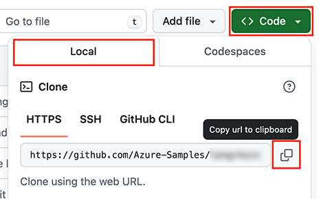

<!-- prettier-ignore -->
<div align="center">


# Serverless Recipes for JavaScript/TypeScript

[](https://codespaces.new/Azure-Samples/serverless-recipes-javascript?hide_repo_select=true&ref=main&quickstart=true)
[](https://github.com/Azure-Samples/serverless-recipes-javascript/actions)

[](https://www.typescriptlang.org)
[](LICENSE)

⭐ If you like this project, star it on GitHub — it helps a lot!

[Overview](#overview) • [Get started](#getting-started) • [Run the samples](#run-the-ssamples) • [Resources](#resources) • [Troubleshooting](#troubleshooting)

</div>

This repository is a collection of code examples demonstrating how to build serverless applications using TypeScript and Azure. Each recipe is a standalone sample that demonstrates how to build a specific feature or use a specific technology. You can use these samples as a starting point for your own projects or to learn more about serverless development with Azure.

> [!NOTE]
> **What's Serverless?**<br>
> Serverless computing allows you to build and run applications without managing infrastructure. You can focus on your code and let the cloud provider handle the rest. Azure provides a wide range of serverless services, including [Azure Functions](https://learn.microsoft.com/azure/azure-functions/functions-overview?pivots=programming-language-javascript), [Azure Static Web Apps]([Azure Static Web Apps](https://learn.microsoft.com/azure/static-web-apps/overview), [Azure Cosmos DB](https://learn.microsoft.com/azure/cosmos-db/nosql/), and more.

## Why serverless?

Let's say you're a developer for the Contoso Solutions company, and you've been tasked to build new applications with a fast turnaround time, startup style. You need to build these apps quickly with a low initial budget, and you don't want to worry about managing servers, scaling, or infrastructure. **You want to focus on writing code and delivering value to your users.**

*This is exactly where serverless is a great fit!*

While walking through this collection of ready-to-use code examples, you'll learn how to solve common problems and build applications using many of the serverless technologies available on Azure. The best part? You only need to pay attention to the code and the business logic, all samples are ready to deploy and run in your Azure account.

## Prerequisites
- **Azure account**. If you're new to Azure, [get an Azure account for free](https://azure.microsoft.com/free) to get free Azure credits to get started. If you're a student, you can also get free credits with [Azure for Students](https://aka.ms/azureforstudents).
- **GitHub account**. If you don't have one, you can [create a free GitHub account](https://github.com/signup). You can optionally use [GitHub Copilot Free](https://github.com/features/copilot) to help you write code and ship your application even faster.

## Getting started

There are multiple ways to get started with this project.

The quickest way is to use [GitHub Codespaces](#use-github-codespaces) that provides a preconfigured environment for you. Alternatively, you can [set up your local environment](#use-your-local-environment) following the instructions below.

<details open>
<summary><h3>Use GitHub Codespaces</h3></summary>

You can run this project directly in your browser by using GitHub Codespaces, which will open a web-based VS Code:

[](https://codespaces.new/Azure-Samples/serverless-recipes-javascript?hide_repo_select=true&ref&quickstart=true)

</details>

<details>
<summary><h3>Use a VSCode dev container</h3></summary>

A similar option to Codespaces is VS Code Dev Containers, that will open the project in your local VS Code instance using the [Dev Containers extension](https://marketplace.visualstudio.com/items?itemName=ms-vscode-remote.remote-containers).

You will also need to have [Docker](https://www.docker.com/get-started/) installed on your machine to run the container.

[](https://vscode.dev/redirect?url=vscode://ms-vscode-remote.remote-containers/cloneInVolume?url=https://github.com/Azure-Samples/serverless-recipes-javascript)

</details>

<details>
<summary><h3>Use your local environment</h3></summary>

You need to install following tools to work on your local machine:

- [Node.js LTS](https://nodejs.org/en/download)
- [Azure Developer CLI](https://aka.ms/azure-dev/install)
- [Git](https://git-scm.com/downloads)
- [PowerShell 7+](https://github.com/powershell/powershell) _(for Windows users only)_
  - **Important**: Ensure you can run `pwsh.exe` from a PowerShell command. If this fails, you likely need to upgrade PowerShell.
  - Instead of Powershell, you can also use Git Bash or WSL to run the Azure Developer CLI commands.
- [Azure Functions Core Tools](https://learn.microsoft.com/azure/azure-functions/functions-run-local?tabs=macos%2Cisolated-process%2Cnode-v4%2Cpython-v2%2Chttp-trigger%2Ccontainer-apps&pivots=programming-language-javascript) _(should be installed automatically with NPM, only install manually if the API fails to start)_

Then you can get the project code:

1. [**Fork**](https://github.com/Azure-Samples/serverless-recipes-javascript/fork) the project to create your own copy of this repository.
2. On your forked repository, select the **Code** button, then the **Local** tab, and copy the URL of your forked repository.

   
3. Open a terminal and run this command to clone the repo: `git clone <your-repo-url>`

</details>

## Run the samples

After setting up your environment, you can deploy and run any of the samples. Each sample is a standalone project that you can run independently. Follows these steps to run a sample:

```bash
# Open the sample directory
cd samples/<sample-name>

# Install dependencies
npm install

# Deploy the sample to Azure
azd auth login
azd up
```

Once the initial deployment is completed, you can also run the sample locally with `npm start`.
You can check the `README.md` file in each sample directory for more specific instructions.

## Samples list

<!-- #begin-samples -->

| Icon | Sample | Description | Deployment Time | Video | Blog |
| --- |:--- |:--- | --- | --- | --- |
|  | [Azure Functions OpenAI extension - text embeddings](./samples/openai-extension-embeddings) | This sample demonstrates how to use Azure OpenAI text embeddings with Azure Functions the Azure OpenAI extension. | 5min | [📺](TODO) | [📚](TODO) |
|  | [Azure Functions OpenAI extension - text completion](./samples/openai-extension-textcompletion) | This sample demonstrates how to use Azure OpenAI text completions with Azure Functions the Azure OpenAI extension. | 5min | [📺](TODO) | [📚](TODO) |

<!-- #end-samples -->

## Resources

Here are some additional resources to learn more about the technologies used:

- [Serverless Node.js with Azure Functions](https://learn.microsoft.com/azure/developer/javascript/how-to/develop-serverless-apps?tabs=v4-ts) (Microsoft Learn)
- [Azure Cosmos DB for NoSQL](https://learn.microsoft.com/azure/cosmos-db/nosql/) (Microsoft Learn)
- [Azure OpenAI Service](https://learn.microsoft.com/azure/ai-services/openai/overview) (Microsoft Learn)
- [Generative AI with JavaScript](https://github.com/microsoft/generative-ai-with-javascript) (GitHub)
- [Serverless AI Chat with RAG using LangChain.js](https://github.com/Azure-Samples/serverless-chat-langchainjs) (GitHub)

## Troubleshooting

If you have any issue when running or deploying the samples, please check the [troubleshooting guide](./docs/troubleshooting.md). If you can't find a solution to your problem, please [open an issue](https://github.com/Azure-Samples/serverless-recipes-javascript/issues) in this repository.

## Contributing

This project welcomes contributions and suggestions. Most contributions require you to agree to a
Contributor License Agreement (CLA) declaring that you have the right to, and actually do, grant us
the rights to use your contribution. For details, visit https://cla.opensource.microsoft.com.

When you submit a pull request, a CLA bot will automatically determine whether you need to provide
a CLA and decorate the PR appropriately (e.g., status check, comment). Simply follow the instructions
provided by the bot. You will only need to do this once across all repos using our CLA.

This project has adopted the [Microsoft Open Source Code of Conduct](https://opensource.microsoft.com/codeofconduct/).
For more information see the [Code of Conduct FAQ](https://opensource.microsoft.com/codeofconduct/faq/) or
contact [opencode@microsoft.com](mailto:opencode@microsoft.com) with any additional questions or comments.

## Trademarks

This project may contain trademarks or logos for projects, products, or services. Authorized use of Microsoft
trademarks or logos is subject to and must follow
[Microsoft's Trademark & Brand Guidelines](https://www.microsoft.com/en-us/legal/intellectualproperty/trademarks/usage/general).
Use of Microsoft trademarks or logos in modified versions of this project must not cause confusion or imply Microsoft sponsorship.
Any use of third-party trademarks or logos are subject to those third-party's policies.
