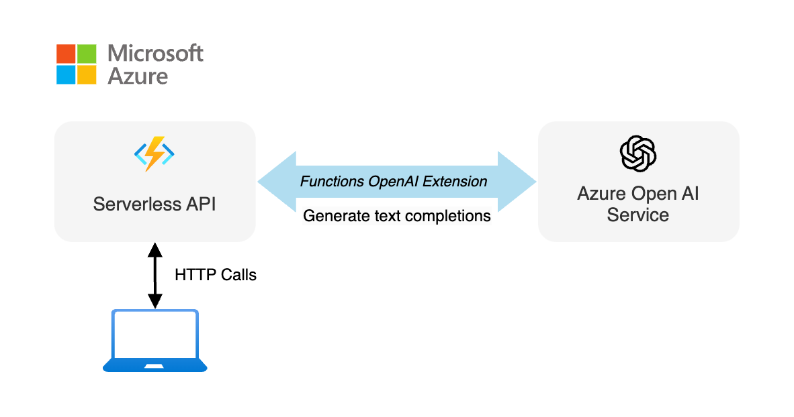

<!--
---
page_type: sample
languages:
  - azdeveloper
  - javascript
  - typescript
  - nodejs
  - bicep
products:
  - azure
  - azure-openai
  - ai-services
urlFragment: openai-extension-textcompletion-javascript
name: Azure Functions OpenAI extension - text completion
description: This sample demonstrates how to build use Azure OpenAI text completions with Azure Functions the Azure OpenAI extension.
---
-->

<!-- prettier-ignore -->
<!-- Learn samples onboarding: https://review.learn.microsoft.com/en-us/help/contribute/samples/process/onboarding?branch=main -->

<div align="center">


# Azure Functions OpenAI extension - text completion

[](https://codespaces.new/Azure-Samples/serverless-recipes-javascript?hide_repo_select=true&ref=main&quickstart=true)


<!-- [](TODO) -->

[Overview](#overview) • [Run the sample](#run-the-sample) • [Key concepts](#key-concepts) • [Troubleshooting](#troubleshooting) • [Next steps](#next-steps)

</div>

This sample demonstrates how to use Azure OpenAI text completions with [Azure Functions](https://learn.microsoft.com/azure/azure-functions/functions-overview?pivots=programming-language-javascript) the [Azure OpenAI extension](https://learn.microsoft.com/azure/azure-functions/functions-bindings-openai?tabs=isolated-process&pivots=programming-language-typescript).

- [📺 YouTube](TODO) - This sample explained in video
- [📚 Azure Blog](TODO) - Related blog post

## Overview



This application is made from multiple components:

- A serverless API built with [Azure Functions](https://learn.microsoft.com/azure/azure-functions/functions-overview?pivots=programming-language-javascript) using [Azure Functions bindings for OpenAI](https://github.com/Azure/azure-functions-openai-extension).

- Hosted AI models with [Azure OpenAI](https://learn.microsoft.com/azure/ai-services/openai/overview).

## Run the sample

### Prerequisites

- [Node.js LTS](https://nodejs.org/en/download/)
- [Azure Developer CLI](https://aka.ms/azure-dev/install)
- [Git](https://git-scm.com/downloads)
- Azure account. If you're new to Azure, [get an Azure account for free](https://azure.microsoft.com/free) to get free Azure credits to get started. If you're a student, you can also get free credits with [Azure for Students](https://aka.ms/azureforstudents).
- Azure account permissions:
  - Your Azure account must have `Microsoft.Authorization/roleAssignments/write` permissions, such as [Role Based Access Control Administrator](https://learn.microsoft.com/azure/role-based-access-control/built-in-roles#role-based-access-control-administrator-preview), [User Access Administrator](https://learn.microsoft.com/azure/role-based-access-control/built-in-roles#user-access-administrator), or [Owner](https://learn.microsoft.com/azure/role-based-access-control/built-in-roles#owner). If you don't have subscription-level permissions, you must be granted [RBAC](https://learn.microsoft.com/azure/role-based-access-control/built-in-roles#role-based-access-control-administrator-preview) for an existing resource group and [deploy to that existing group](docs/deploy_existing.md#resource-group).
  - Your Azure account also needs `Microsoft.Resources/deployments/write` permissions on the subscription level.

### Cost estimation

Pricing varies per region and usage, so it isn't possible to predict exact costs for your usage.
However, you can use the [Azure pricing calculator](https://azure.com/e/d8dffb8ec0544c4299a4bf0a123be4f5) for the resources below to get an estimate.

- Azure Functions: Flex Consumption plan, Free for the first 250K executions. Pricing per execution and memory used. [Pricing](https://azure.microsoft.com/pricing/details/functions/)
- Azure OpenAI: Standard tier, GPT and Ada models. Pricing per 1K tokens used, and at least 1K tokens are used per question. [Pricing](https://azure.microsoft.com/pricing/details/cognitive-services/openai-service/)
- Azure Blob Storage: Standard tier with LRS. Pricing per GB stored and data transfer. [Pricing](https://azure.microsoft.com/pricing/details/storage/blobs/)

⚠️ To avoid unnecessary costs, remember to take down your app if it's no longer in use,
either by deleting the resource group in the Portal or running `azd down --purge`.

### Setup development environment

You can run this project directly in your browser by using GitHub Codespaces, which will open a web-based VS Code.

1. [**Fork**](https://github.com/Azure-Samples/serverless-recipes-javascript/fork) the project to create your own copy of this repository.
2. On your forked repository, select the **Code** button, then the **Codespaces** tab, and clink on the button **Create codespace on main**.
   
3. Wait for the Codespace to be created, it should take a few minutes.

If you prefer to run the project locally, follow [these instructions](../../README.md#use-your-local-environment).

### Deploy Azure resources

Open a terminal in the project root and follow these steps to deploy the Azure resources needed:

```bash
# Open the sample directory
cd samples/openai-extension-textcompletion

# Install dependencies
npm install

# Deploy the sample to Azure
azd auth login
azd up
```

You will be prompted to select a base location for the resources. If you're unsure of which location to choose, select `eastus2`.
The deployment process will take a few minutes.

### Test the application

Once the resources are deployed, you can run the following command to run the application locally:

```bash
npm start
```

This command will start the Azure Functions application locally. You can test the application by sending a GET request to the `/whois` endpoint:

```bash
curl http://localhost:7071/api/whois/Albert%20Einstein
```

You should receive a response with information about Albert Einstein.
You also try sending a POST request to the `/completions` endpoint:

```bash
curl http://localhost:7071/api/completions -H "Content-Type: application/json" -d '{"prompt": "Capital of France?"}'
```

You should receive a response with the completion of the prompt.
Alternatively, you can also open the file `api.http` and click on **Send Request** to test the endpoints.

### Clean up

To clean up all the Azure resources created by this sample:

1. Run `azd down --purge`
2. When asked if you are sure you want to continue, enter `y`

The resource group and all the resources will be deleted.

## Key concepts

Open the `src/functions` folder to see the code for the Azure Functions. Our API is composed of two endpoints:

- `POST /completions`: This endpoint take a JSON object with a `prompt` property and returns a completion generated by the LLM (Large Language Model). It uses the OpenAI text completion input binding to generate the completion.

- `GET /whois/<name>`: This endpoint takes a name as a route parameter and returns information about the person, using a prompt template to query the LLM through the OpenAI text completion input binding.

## Troubleshooting

If you have any issue when running or deploying this sample, please check the [troubleshooting guide](../../docs/troubleshooting.md). If you can't find a solution to your problem, please [open an issue](https://github.com/Azure-Samples/serverless-recipes-javascript/issues).

## Next steps

Here are some resources to learn more about the technologies used in this sample:

- [Azure OpenAI text completion input binding for Azure Functions](https://learn.microsoft.com/azure/azure-functions/functions-bindings-openai-textcompletion-input?tabs=isolated-process&pivots=programming-language-typescript) (Microsoft Learn)
- [Azure Functions bindings for OpenAI](https://github.com/Azure/azure-functions-openai-extension) (GitHub)
- [Azure OpenAI Service](https://learn.microsoft.com/azure/ai-services/openai/overview) (Microsoft Learn)
- [Generative AI with JavaScript](https://github.com/microsoft/generative-ai-with-javascript) (GitHub)
